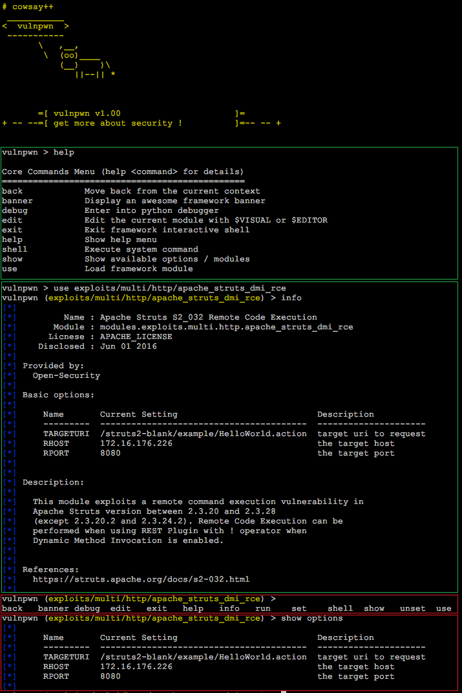

# vulnpwn

[](https://www.python.org/) [](https://github.com/nixawk/python-programming/blob/master/Framework/vulnpwn/LICENSE) [](https://twitter.com/nixawk)


## Overview

**vulnpwn** is a pythonic framework which is similar to [metasploit-framework](https://github.com/rapid7/metasploit-framework). If you are interested in python pragramming, please join us to create a good open-source project.


## Requirements

- Python 2.7+
- Works on Linux, Windows, Mac OSX, BSD

## Usage

### console

The quick way:



### autopwn

Autopwn is a gun for you to scan target with multi pocs.

```
vulnpwn > use exploits/autopwn
vulnpwn (exploits/autopwn) > show options
[*]
[*]     Name   Current Setting  Description
[*]     -----  ---------------  ---------------
[*]     RHOST  192.168.1.1      the target host
[*]     RPORT  80               the target port
[*]
vulnpwn (exploits/autopwn) > info
[*]
[*]         Name : autopwn scanner
[*]       Module : modules.exploits.autopwn
[*]      Licnese : APACHE_LICENSE
[*]    Disclosed : June 10 2016
[*]
[*] Provided by:
[*]   Open-Security
[*]
[*] Basic options:
[*]
[*]     Name   Current Setting  Description
[*]     -----  ---------------  ---------------
[*]     RHOST  192.168.1.1      the target host
[*]     RPORT  80               the target port
[*]
[*]
[*] Description:
[*]   scan target with all exploits modules automatically
[*]
[*] References:
[*]   https://github.com/open-security/vulnpwn
[*]
vulnpwn (exploits/autopwn) > show options
[*]
[*]     Name   Current Setting  Description
[*]     -----  ---------------  ---------------
[*]     RHOST  192.168.1.1      the target host
[*]     RPORT  80               the target port
[*]
vulnpwn (exploits/autopwn) > run
[*] Exploiting - http://192.168.1.1:80/command.php
[*] Exploiting - http://192.168.1.1:80/diagnostic.php
[*] Exploiting - http://192.168.1.1:80/struts2-blank/example/HelloWorld.action
```

When **RPORT** is unset in ***exploits/autopwn***, every module has a default **RPORT** setting.

```
vulnpwn (exploits/autopwn) > unset RPORT
vulnpwn (exploits/autopwn) > run
[*] Exploiting - http://192.168.1.1:80/command.php
[*] Exploiting - http://192.168.1.1:80/diagnostic.php
[*] Exploiting - http://192.168.1.1:8080/struts2-blank/example/HelloWorld.action
```

If both of **RHOST** and **RPORT** are unset, autopwn will use options settings from exploits modules. ex:

```
vulnpwn (exploits/autopwn) > unset RHOST
vulnpwn (exploits/autopwn) > unset RPORT
vulnpwn (exploits/autopwn) > run
[*] Exploiting - http://192.168.1.1:80/command.php
[*] Exploiting - http://192.168.1.1:80/diagnostic.php
[*] Exploiting - http://172.16.176.226:8080/struts2-blank/example/HelloWorld.action
```

## Features

- Tab Completion
- Module extension design
- Module validation
- Autopwn


## How to Contribute

1. Check for open issues or open a fresh issue to start a discussion around a feature idea or a bug.
2. Fork [the repository](https://github.com/nixawk/python-programming/tree/master/Framework/vulnpwn) on GitHub to start making your changes to the **master** branch (or branch off of it).
3. Write a test which shows that the bug was fixed or that the feature works as expected.
4. Send a pull request and bug the maintainer until it gets merged and published. Make sure to add yourself to [THANKS](./THANKS.md).
